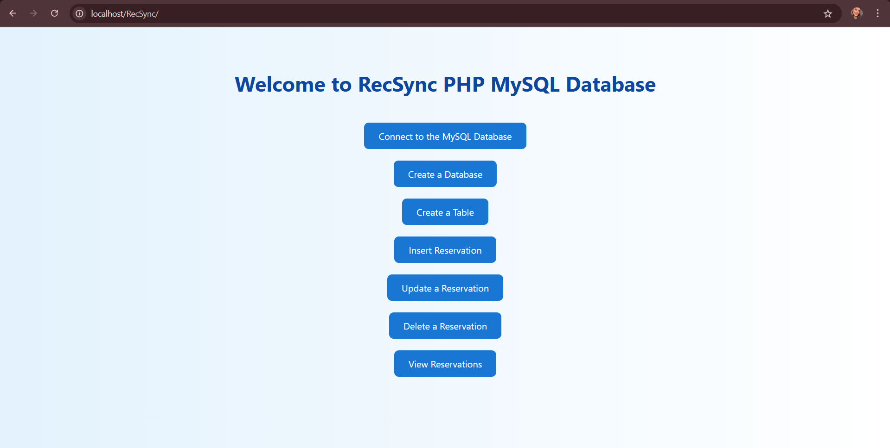
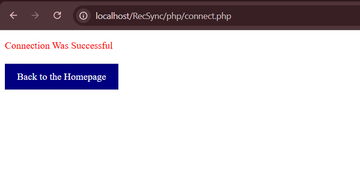

# 🏕️ RecSync – Reservation Facility Management System

A web-based reservation management system built using **PHP** and **MySQL**, designed to handle facility bookings for a recreational center. This project was created as part of coursework on relational database design and web-based CRUD applications.

---

## 🎯 Project Objective

To create a simple and functional system that allows users to:
- View existing reservations
- Add new reservation entries
- Update existing records
- Delete entries
- Filter bookings based on criteria like time or guest count

---

## 🧰 Tech Stack

- **Frontend:** HTML (within PHP), basic styling
- **Backend:** PHP (vanilla)
- **Database:** MySQL (via XAMPP)
- **Tools:** XAMPP, phpMyAdmin

---

## 🗂️ Project Structure

RecSync/
├── db.php # Database connection file
├── index.php # Main page – lists all reservations
├── insert.php # Form and logic to insert new records
├── update.php # Edit and update existing reservations
├── delete.php # Delete a reservation
├── filter.php # Filter/search reservations
├── README.md # Project documentation
└── reservation.sql # (optional) Table creation script


---

## 🗃️ Database Schema

Table: `reservation`  
Fields used:

- `reservation_id` – INT, Primary Key  
- `reservation_time` – DATETIME  
- `guest_count` – INT  
- `checked_in` – BOOLEAN  

> Foreign keys were removed in this version for simplified standalone functionality.

---

## 🚀 How to Run the Project

1. **Install XAMPP** (if not already): [https://www.apachefriends.org](https://www.apachefriends.org)
2. Place the project folder `RecSync/` inside:
   C:\xampp\htdocs\
3. Start **Apache** and **MySQL** from the XAMPP Control Panel
4. Open `phpMyAdmin` and create a database named:
5. Create the `reservation` table using this SQL:

```sql
CREATE TABLE reservation (
reservation_id INT AUTO_INCREMENT PRIMARY KEY,
reservation_time DATETIME NOT NULL,
guest_count INT NOT NULL,
checked_in BOOLEAN DEFAULT FALSE
);

6. Open your browser and go to:  
   `http://localhost/RecSync/index.php`

---

## 🖼️ User Interface Preview

Here’s what the RecSync system looks like when running locally:

### 🔹 Homepage



### 🔹 Database Connection Status



---

## 🙋‍♀️ Author

**Kajal Singh**  
Student | Data Analytics & Information Systems  
📍 Vancouver, Canada  
📧 kajalsingh.1303@gmail.com  
🔗 [GitHub Profile](https://github.com/KajalS99)

---

> “Built to learn, scaled to serve.” 🌱


